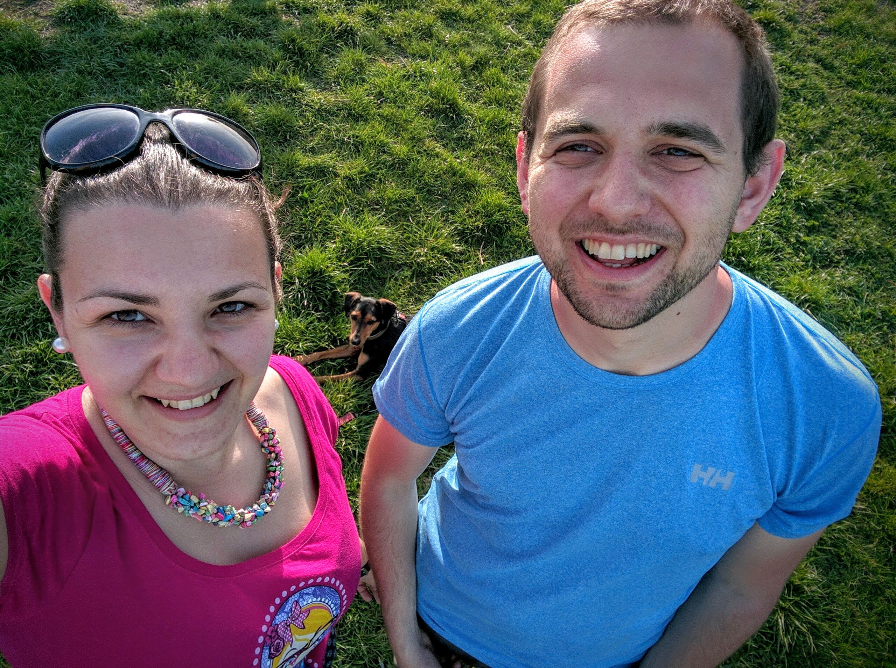
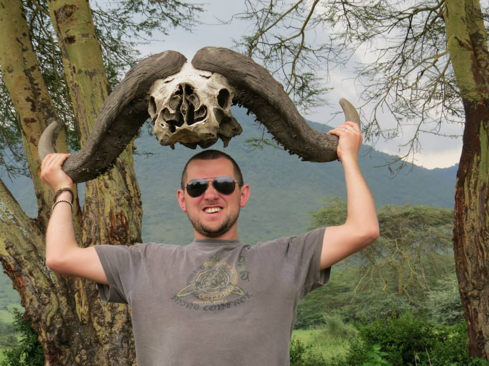

Hi there! I'm Sebastian Cachia, though most people just call me Seb. I was born and raised in the European island nation of [Malta](http://www.kitchenvoyage.com/2016/03/16/malta-my-home-country/). After a few years living in Budapest, Hungary I am currently back living in Malta with my wife [Marica](http://www.kitchenvoyage.com/) and our dog Flora.

<figure>
  
</figure>

Professionally, I am a technology geek with a wide passion for learning. So far I have found Product Management to be the best fit, though I am also interested in Engineering Management and User Experience Design. I sometimes hack around in code, though mostly to serve my own needs (nothing production grade here).

I love being outdoors! I grew up (with my now wife) in Scouts and enjoy hiking, running, camping, or anything else I can find time for.  I have been hiking in the Bavarian Alps, Snowdonia and the Black Mountains in Wales and climbed Kilimanjaro in Tanzania. I also enjoy cooking, reading, strong coffee and travel.

<figure>
  
</figure>

This blog is mostly intended as a repository for posts tackling my professional interests, though I might occasionally deviate into any of my other current (or future) interests.

### Getting in Touch
If you know me professionally, please connect to me on [LinkedIn](http://linkedin.com/in/sebcachia). If we have never met, please connect on [Twitter](http://twitter.com/sebcachia) or send me a [short](http://five.sentenc.es/) email on mail@thisdomain.com.
